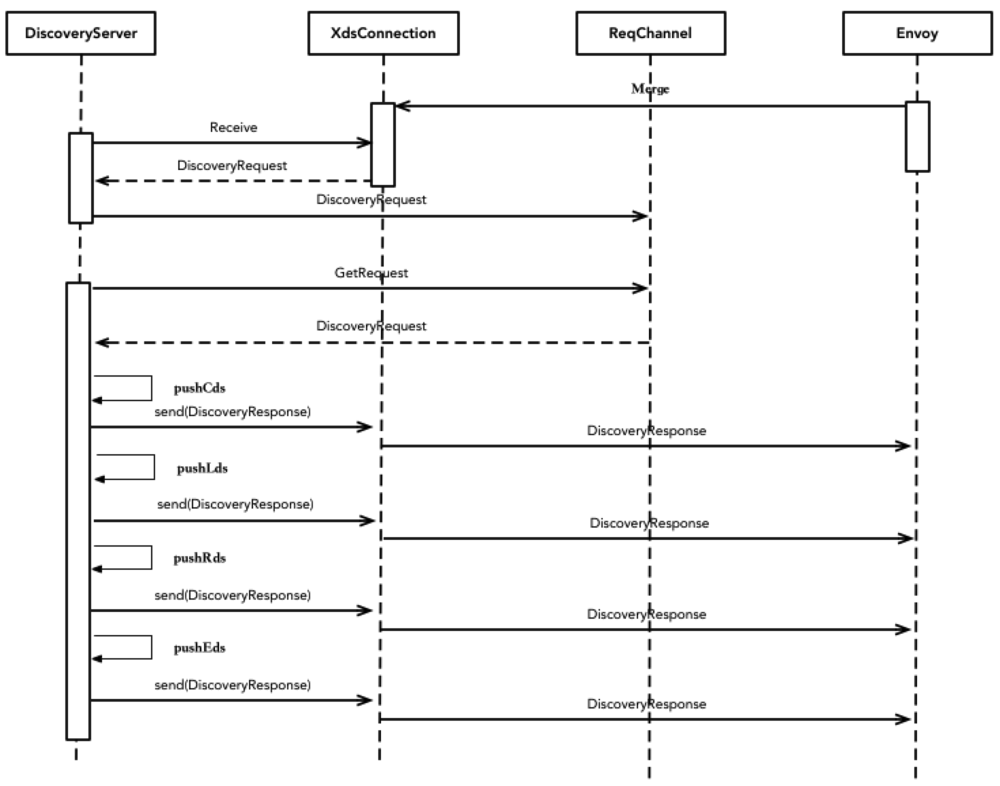

# Envoy主动请求推送
Envoy通过gRPC连接发送xDS请求。
Pilot和Envoy之间建立一个双向的Streaming GRPC调用，因此在Pilot可以在配置变化时候，向Envoy推送变化信息；同时，Envoy也可以主动发起xDS调用。
Envoy主动发起调用主要包括：
* 1、Envoy启动过程的xDS请求 
* 2、grpc连接断开后，重连过程。这个包括pilot启动以及grpc周期性重连

具体的过程如下
* 1、envoy向pilot发起DiscoveryRequest
* 2、pilot通过一个goroutine，从xdsConnection中获取req，并将req发送至reqChannel
  
  具体代码见：istio/pilot/pkg/proxy/envoy/v2/ads.go
  ```go
    func receiveThread(con *XdsConnection, reqChannel chan *xdsapi.DiscoveryRequest, errP *error) {
        defer close(reqChannel) // indicates close of the remote side.
        for {
            // 从connection接收请求，没有信息，该方法会阻塞
            req, err := con.stream.Recv()
            if err != nil {
                .....
            }
            select {
            //将请求req发送至reqChannel
            case reqChannel <- req:
            case <-con.stream.Context().Done():
                // 客户端envoy主动关闭连接
                adsLog.Errorf("ADS: %q %s terminated with stream closed", con.PeerAddr, con.ConID)
                return
            }
        }
    }
  ```
* 3、Discovery Cover从reqChannel中阻塞获取信息，解析disReq，获取请求类型。组装生成xDS信息，发送给envoy。
    ads发送顺序为：cds、eds、lds、rds。具体代码模块见：istio/pilot/pkg/proxy/envoy/v2/ads.go
```go
    // StreamAggregatedResources implements the ADS interface.
func (s *DiscoveryServer) StreamAggregatedResources(stream ads.AggregatedDiscoveryService_StreamAggregatedResourcesServer) error {
   peerInfo, ok := peer.FromContext(stream.Context())
   peerAddr := "0.0.0.0"
   if ok {
      peerAddr = peerInfo.Addr.String()
   }
   //xDS connection
   con := newXdsConnection(peerAddr, stream)
   // reqChannel
   reqChannel := make(chan *xdsapi.DiscoveryRequest, 1)
   //单独goroutine，将req写入reqChannel
   go receiveThread(con, reqChannel, &receiveError)

   node := &core.Node{}
   for {
      // Block until either a request is received or a push is triggered.
      select {
      case discReq, ok := <-reqChannel
         switch discReq.TypeUrl {
         case ClusterType:
             .......
            // pushCds
            err := s.pushCds(con, s.globalPushContext(), versionInfo())
         case ListenerType:
             .........
            // pushLds
            err := s.pushLds(con, s.globalPushContext(), versionInfo())
         case RouteType:
             ......
            // pushRds
            err := s.pushRoute(con, s.globalPushContext(), versionInfo())
            if err != nil {
               return err
            }
         case EndpointType:
             .....
             // pushEds, 其中eds也可以单独发送
            err := s.pushEds(s.globalPushContext(), con, versionInfo(), nil)
         default:
            adsLog.Warnf("ADS: Unknown watched resources %s", discReq.String())
         }
         //从PushChannel接收Service/Config变化后的通知
      case pushEv := <-con.pushChannel:
          .....
      }
   }
}
```

详细时序图如下：


