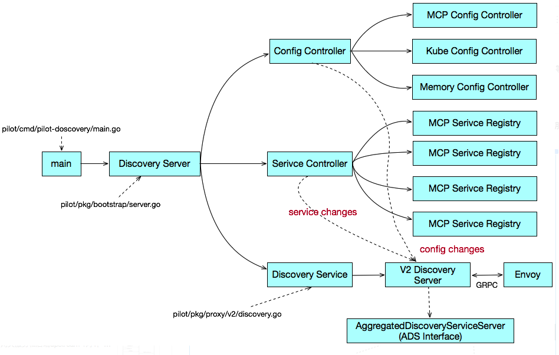

## pilot数据来源
目前pilot的输入包括两部分数据来源
服务数据：来源于各个服务注册表（Service Registry），例如k8s中注册的Servive, Cosul中的服务等
配置规则：包括路由规则以及流量管理规则，通过K8S CRD形式定义并存在在K8S中

Pilot Discovery代码结构：
Istio Pilot的代码氛围Pilot-Discovery和Pilot-Agent。Pilot-Agent用于在数据面负责Envoy的生命周期管理，Pilot Discovery是控制面进行流量管理的组件，主要分析控制面部分，即Pilot-Discovery的代码。



### Config Controller：
Config Controller用于管理各种配置数据，包括用户创建的流量管理规则和策略。istio目前支持三种类型的Config Controller。
Kubernates：使用kubernaters来作为配置数据的存储，该方式直接依附于K8s强大的CRD机制来存储配置数据，简单方便，是ISTIO最开始使用的配置存储方案。
MCP（Mesh Configuration Protocol）：使用K8S来存储配置数据导致istio和K8S耦合，限制了ISITO在非K8s环境中的使用。为了解决该耦合，社区提出MCP，MCP定义了一个向istio控制面下发配置数据的标准协议，istio pilot作为mcp cliet，任何实现mcp协议的server都可以通过MCP协议向Pilot下发配置，解除K8S的耦合。
Memory：一个在内存中的Config Controllrt实现，主要用于测试

目前istio的配置包括：
Virtual Service：定义流量路由规则
Destination Rule: 定义和一个服务或者subset相关的流量处理规则，包括负载均衡策略，连接池大小，断路器设置，subset定义等
Gateway： 定义入口网关上对外暴露的服务
Service Entry： 将外部服务手动添加到网格中
Envoy Filter: 通过pilot在Envoy的配置添加一个自定义filter

### Service Controller：
Service Controller用于管理各种Service Registry。目前Istio支持的Service Registry包括：
K8S：对接Kubernetes Registry，可以将K8S中定义的Service和Istance采集到Istio中
Consul: 对接Consul Catalog，将Consul中定义的Service 采集到Istio中
MCP：和MCP config controller类似，从MCP service中获取service和service instance
Memory: 一个内存中的Service Controller实现，主要用于测试

### Discovery Service:
Discovery Service主要包含以下逻辑：
启动gRPC server并接收来自Envoy端的连接请求
接收Envoy端的xDS请求，从Config Controller和Service Controller中获取配置和服务信息，生成响应信息发送至Envoy
监听来自Config Controller的配置变化消息和来自Service Controller的服务变化消息，并将配置和服务变化内容通过xDS推送至Envoy

## Discovery Server业务处理关键代码
### 处理xDS请求和推送的关键代码
istio.io/isio/pilot/pkg/proxy/envoy/v2/ads.go文件的StreamAggregatedResources方法中。StreamAggregatedResources方法被注册为gRPC server的handler，对于每一个客户端连接，gRPC server会启动一个goroutine进行处理。
主要包括：
1、从gRPC连接中接收来自Envoy的xDS请求，并放到一个channel reqChannel中
2、从reqChannel中接收xDS请求，根据xDS请求类型构造响应并发送至Envoy
3、从connection的pushChannel中接收Service或Config变化后的通知，构造xDS响应消息，将变化内容推送到Envoy
```go
// StreamAggregatedResources implements the ADS interface.
func (s *DiscoveryServer) StreamAggregatedResources(stream ads.AggregatedDiscoveryService_StreamAggregatedResourcesServer) error {        
    ......
    //创建一个goroutine来接收来自Envoy的xDS请求，并将请求放到reqChannel中
    con := newXdsConnection(peerAddr, stream)
    reqChannel := make(chan *xdsapi.DiscoveryRequest, 1)
    go receiveThread(con, reqChannel, &receiveError)
     ......
    for {
        select{
        //从reqChannel接收Envoy端主动发起的xDS请求
        case discReq, ok := <-reqChannel:        
            //根据请求的类型构造相应的xDS Response并发送到Envoy端
            switch discReq.TypeUrl {
            case ClusterType:
                err := s.pushCds(con, s.globalPushContext(), versionInfo())
            case ListenerType:
                err := s.pushLds(con, s.globalPushContext(), versionInfo())
            case RouteType:
                err := s.pushRoute(con, s.globalPushContext(), versionInfo())
            case EndpointType:
                err := s.pushEds(s.globalPushContext(), con, versionInfo(), nil)
            }

        //从PushChannel接收Service或者Config变化后的通知
        case pushEv := <-con.pushChannel:
            //将变化内容推送到Envoy端
            err := s.pushConnection(con, pushEv)   
        }            
    }
}
```

### 处理服务和配置变化的关键代码
istio.io/istio/pilot/pkg/proxy/envoy/v2/discovery.go，用于监听服务和配置变化消息，并将变化消息合并后通过channel发送给StreamAggregatedResources方法进行处理。
ConfigUpdate是处理服务和配置变化的回调函数，service controller和config controller在发生变化时会调用该方法通知Discovery Server
```go
func (s *DiscoveryServer) ConfigUpdate(req *model.PushRequest) {
  inboundConfigUpdates.Increment()
  //服务或配置变化后，将一个PushRequest发送到pushChannel中
  s.pushChannel <- req
}
```

在debounce方法中，将连续发生的PushRequest进行合并，如果一段时间内没有收到新的PushRequest，再发起推送；以避免由于服务和配置频繁变化给系统带来的压力
```go
// The debounce helper function is implemented to enable mocking
func debounce(ch chan *model.PushRequest, stopCh <-chan struct{}, pushFn func(req *model.PushRequest)) {
    ......
    pushWorker := func() {
        eventDelay := time.Since(startDebounce)
        quietTime := time.Since(lastConfigUpdateTime)

        // it has been too long or quiet enough
        //一段时间内没有收到新的PushRequest，再发起推送
        if eventDelay >= DebounceMax || quietTime >= DebounceAfter {
            if req != nil {
                pushCounter++
                adsLog.Infof("Push debounce stable[%d] %d: %v since last change, %v since last push, full=%v",
                pushCounter, debouncedEvents,
                quietTime, eventDelay, req.Full)

                free = false
                go push(req)
                req = nil
                debouncedEvents = 0
            }
        } else {
           timeChan = time.After(DebounceAfter - quietTime)
        }
    }
    for {
        select {
        ......
        case r := <-ch:
            lastConfigUpdateTime = time.Now()
            if debouncedEvents == 0 {
                timeChan = time.After(DebounceAfter)
                startDebounce = lastConfigUpdateTime
            }
            debouncedEvents++
            //合并连续发生的多个PushRequest
            req = req.Merge(r)
        case <-timeChan:
           if free {
               pushWorker()
            }
        case <-stopCh:
            return
    }
  }
}
```