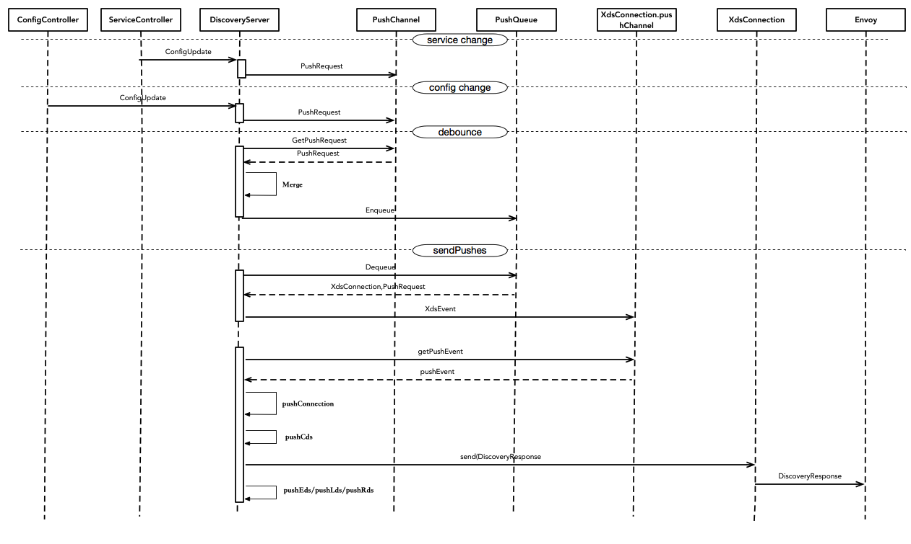

# 配置变更推送
包括集群中svc变化或Istio config变化两方面

## 1、配置变化包括服务变化/配置变化
即Service Controller/Config COntroller监听到集群中的配置变化，分别回调ConfigUpdate方法，通知DiscoverServer
这里关键在于理解DiscoveryServer中的回调逻辑，DiscoveryServer会回调三个函数，
AppendServiceHandler、AppendInstanceHandler、ResisterEventHandler


* ServiceHandler：主要处理service变化
* InstanceHandler：主要处理服务实例，包括endpoint变化
* EventHandler：主要处理Istio CRD配置变化。
具体的注册代码如下：
istio/pilot/pkg/proxy/envoy/v2/discovery.go

```go
// Flush cached discovery responses whenever services, service
// instances, or routing configuration changes.
serviceHandler := func(*model.Service, model.Event) { out.clearCache() }
if err := ctl.AppendServiceHandler(serviceHandler); err != nil {
   return nil
}
instanceHandler := func(*model.ServiceInstance, model.Event) { out.clearCache() }
if err := ctl.AppendInstanceHandler(instanceHandler); err != nil {
   return nil
}

// Flush cached discovery responses when detecting jwt public key change.
authn_model.JwtKeyResolver.PushFunc = out.ClearCache

if configCache != nil {
   // TODO: changes should not trigger a full recompute of LDS/RDS/CDS/EDS
   // (especially mixerclient HTTP and quota)
   configHandler := func(model.Config, model.Event) { out.clearCache() }
   for _, descriptor := range model.IstioConfigTypes {
      configCache.RegisterEventHandler(descriptor.Type, configHandler)
   }
}

```

其中eds推送可以增量推送，具体代码见
istio/pilot/pkg/proxy/envoy/v2/eds.go
```go
s.ConfigUpdate(&model.PushRequest{
   Full:             false,
   TargetNamespaces: map[string]struct{}{namespace: {}},
   EdsUpdates:       map[string]struct{}{serviceName: {}},
})
```

## 2、discovery通过一个goroutine从PushChannel中接收变化信息
discovery开启多个协程，如下
```go
func (s *DiscoveryServer) Start(stopCh <-chan struct{}) {
    // 处理配置变化
   go s.handleUpdates(stopCh)
   go s.periodicRefresh(stopCh)
   go s.periodicRefreshMetrics(stopCh)
   //发送变化
   go s.sendPushes(stopCh)
}
```

pilot具有防抖机制，将一段时间内的推送进行合并。防止短时间内多次推送，默认为100ms。
pilot将合并后将变化消息推送至Push Queue。推送push queue的代码如下：

```go
// Send a signal to all connections, with a push event.
func (s *DiscoveryServer) startPush(req *model.PushRequest) {

   // Push config changes, iterating over connected envoys. This cover ADS and EDS(0.7), both share
   // the same connection table
   adsClientsMutex.RLock()
   // Create a temp map to avoid locking the add/remove
   pending := []*XdsConnection{}
   //获取集群中所有的connection
   for _, v := range adsClients {
      pending = append(pending, v)
   }
   adsClientsMutex.RUnlock()

   currentlyPending := s.pushQueue.Pending()
   if currentlyPending != 0 {
      adsLog.Infof("Starting new push while %v were still pending", currentlyPending)
   }
   req.Start = time.Now()
   //对于每一个connection，将推送时间发送至Push Queue
   for _, p := range pending {
      s.pushQueue.Enqueue(p, req)
   }
}
```
## 3、另一个goroutine从Push Queue中获取变化消息
另一个goroutine从Push Queue中获取变化消息，生成对应的XdsEvent，发送至每个客户端的push channel中
具体代码如下：istio/pilot/pkg/proxy/envoy/v2/discovery.go
```go
func doSendPushes(stopCh <-chan struct{}, semaphore chan struct{}, queue *PushQueue) {
   for {
      select {
      case <-stopCh:
         return
      default:
         ............
         // 从queue中获取info
         client, info := queue.Dequeue()
         ............
         proxiesQueueTime.Record(time.Since(info.Start).Seconds())

         go func() {
             //仅仅edsUpdates，
            edsUpdates := info.EdsUpdates
            if info.Full {
               // 全量更新，edsUpdates nil
               edsUpdates = nil
            }

            select {
            // 生成对应的XdsEvent，发送至对应client的pushChannel中
            case client.pushChannel <- &XdsEvent{
               push:               info.Push,
               edsUpdatedServices: edsUpdates,
               done:               doneFunc,
               start:              info.Start,
               targetNamespaces:   info.TargetNamespaces,
            }:
               return
            case <-client.stream.Context().Done(): // grpc stream was closed
               doneFunc()
               adsLog.Infof("Client closed connection %v", client.ConID)
            }
         }()
      }
   }
```
## 4、监听到pushChannel变化，触发推送
具体代码如下：
```go
for {
   // Block until either a request is received or a push is triggered.
   select {
   case discReq, ok := <-reqChannel:
     ......
     // 触发推送
   case pushEv := <-con.pushChannel:
       //推送变化
      err := s.pushConnection(con, pushEv)
      pushEv.done()
      if err != nil {
         return nil
      }

   }
}
```

## 详细时序图
详细时序图如下：


从图中可以看到，主要分为
* 1、service change、config change阶段，DiscoveryServer向PushChannel推送配置变化事件
* 2、debounce阶段，pilot由于防抖机制，会进行推送事件合并；在默认100ms推送一次的基础上，触发PushChannel向PushQueue的推送，即Enqueue操作
* 3、sendPushes阶段，DiscoveryServer从pushQueue中获取推送事件，发送至XdsConnection的PushChannel
* 4、配置生成以及推送阶段，改阶段通过select阻塞，接收到Connection的PushChannel的XdsEvent，进行配置推送。此阶段包括通过配置等生成xDS配置，下发至envoy也是pilot组装xDS的核心逻辑。
