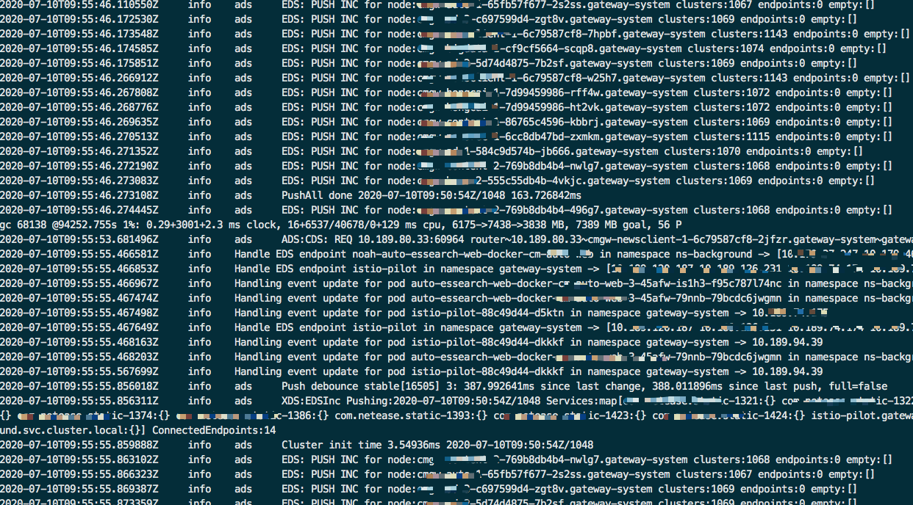

## pilot OOM cause envoy return 503 NR
本问题出现在生产环境，pilot由于内存limit设置较低，集群内的全量推送导致pilot OOM。
* pilot OOM是Istio社区持续优化的点，
目前的模型对应集群内全量推送，在我们生产环境使用过程中，拥有700多台物理机结点。一旦集群内服务发生变化，Istio模型会通过watch机制下发配置。这部分的实现分析可以参考源码部分。
* pilot OOM 影响数据面envoy流量
按照我们生产环境的部署，pilot和envoy分别部署在不同的结点。我们对数据面结点进行独占，同时在node上打污点，防止其他组件/服务的调度。最大力度保证数据面的稳定性。

pilot的OOM理论上应该不会对数据面的流量造成损失。不过在线上，由于一次pilot OOM造成了业务流量1%的损失，不同的网关集群平均出错时间在20-30s。
30s后，随着pilot的启动，数据面恢复正常。

## 分析思路
### 1、恢复线上
生产环境出现问题，第一时间一定是恢复线上，同时如果能保存线上发生问题的文件，尽量保存。
不过，保存文件建立在可以快速恢复线上的基础上。
pilot crash后，会进行对应的crash之前的日志输出，根据日志可以看到一些问题，分析crash之前的pilot状态。
同时，我们对envoy进行改造，注入initContainer coreDump进程，一旦envoy crash后，也有对应的日志信息输出。
生产场景下，pilot OOM crash，由于我们部署在kubernetes中，依赖kubernetes的自动恢复策略，实际上30s内，线上环境pilot结点全部恢复。

### 2、排查pilot crash
通过pilot OOM的crash日志，我们可以看到，在pilot crash前，触发了大量的推送。
由于集群内的服务在短时间内快速推送，导致推送不及时。虽然pilot有防抖机制，默认100ms触发一次推送。
具体配置见：
/istio/pkg/features/pilot/pilot.go
```go
// DebounceAfter is the delay added to events to wait
    // after a registry/config event for debouncing.
    // This will delay the push by at least this interval, plus
    // the time getting subsequent events. If no change is
    // detected the push will happen, otherwise we'll keep
    // delaying until things settle.
    // Default is 100ms, Example: "300ms", "10s" or "2h45m".
    DebounceAfter = env.RegisterDurationVar("PILOT_DEBOUNCE_AFTER", 100*time.Millisecond, "").Get()
```
但是集群内在做集群级别的更新，导致短时间内，svc变化频繁，持续性的推送导致线上pilot OOM产生。具体见日志：


### 3、排查pilot crash后启动过程
pilot OOM后，会被k8s自动恢复。启动过程中，可以看到，观察envoy日志，可以看到pilot确实向envoy推送的不完整的推送。
从envoy的日志可以看到，这个过程发生在envoy启动过程中。

同时继续查看日志，可以看到removing TLS cluster字样，代表本次的cds配置和上一次cds配置相比，确实有所减少。envoy会进行对应的removing。
至此，已经确认了pilot OOM 产生503 NR是在crash后，pilot启动过程中出现。503 NR正好可以对应，no cluster。

继续深入查询，在测试环境进行复现，我们调整pilot 副本为1，同时关闭pilot GC，以模拟pilot crash的场景。从pilot crash开始envoy的连接状态如下：

* 07:16:46 pilot OOM , config grpc closed , envoy first try to reconnect failed, envoy second try to connect failed
* 07:16:47 pilot container started
* 07:16:49 envoy reconnect success
* 07:16:51 pilot pod ip removed from iptables
* 07:18:23 pilot pod ready
可以看到，pilot pod从iptables移除有5-6s的时间gap。这个原因是我们环境对kube-proxy设置了cpu limit。由于CPU throttle的原因，导致pilot pod ip从iptables移除需要一定的时间。
这个时间，足以导致envoy grpc重新连接到pilot上。
由于pilot此时还未ready，异常crash情况下，进程很快启动，开启grpc端口，xDS client（envoy）连接到对应的grpc端口, 触发配置下发。
由此我们确认，这是一个社区bug，在分析问题的过程中，我们同步向社区提issue，具体见：[pilot oom issue](https://github.com/istio/istio/issues/25495)

### 4、问题明朗
经过多次复现以及跟踪pilot代码，我们发现pilot 正常启动过程中，依赖readiness probe探针，判断自身状态，进而提供grpc服务是无可厚非的。
但是在异常crash情况下，无法立马根据探针确认自己的状态。只要进程开启，pilot可以向envoy推送对应的配置。
可以从社区其他issue看到这个问题：
https://github.com/istio/istio/issues/24117
```
Under normal conditions, on startup, a Pilot pod is not immediately added to the Service / load balancer fronting it, due to warming up of the liveness / readiness checks. However, when a container crashes, it is immediately restarted by the kubelet, and can handle connections from Envoys before the LB controller can take the endpoint out of rotation (the controller does, eventually, based what I'm seeing the API server logs).
```

从这个24117 issue，我们也同步发现社区设计上的一些问题，即，如果readiness probe探针时间设置较短，也有可能发送空的配置。因为svc同步是异步进行；如果一旦探针时间设置较多，也有可能存在不同步的配置下发至proxy envoy。
因此，我们可以通过增加同步标识来修复这个问题，我们提出，在进行controller同步svc/crd配置之前，我们可以进行状态判断，同步之后，将状态改为true即可。
同时，所有的svc以及istio crd同步完成后，我们才认为是所有的状态均同步完成。在这里，我们会给出一个最大等待时间，默认60s。
具体的实现思路可以参考：
```go
var initialKeys map[string]struct{}
var stopFlag bool
var maxWaitTime time.Time
var interval time.Duration

// 1. setup handler
AddFunc: func(obj interface{}) {
  key := objectKey(obj)
  if !stopFlag {
      initialKeys[key] = struct{}{}
  }

  queue.Push(func() error {
    if len(initialKeys) > 0  {
      delete(initialKeys, key)
    }
    
    return c.onServiceEvent(obj, model.EventAdd)
  })
}

// 2. after HasSynced returns true
stopFlag = true

// 3. wait all marked items being processed
PollWait( func() (done bool, err error) {
       return len(initialKeys) == 0, nil
  }, interval, maxWaitTime)

// 4. we are ready
```

一旦所有的配置均同步完成，再进行对应的grpc推送。社区的fix思路也可以参考：https://github.com/istio/istio/pull/25733/commits/62322efe8b43b681a2b43a0cd3fd15fd35227e04


